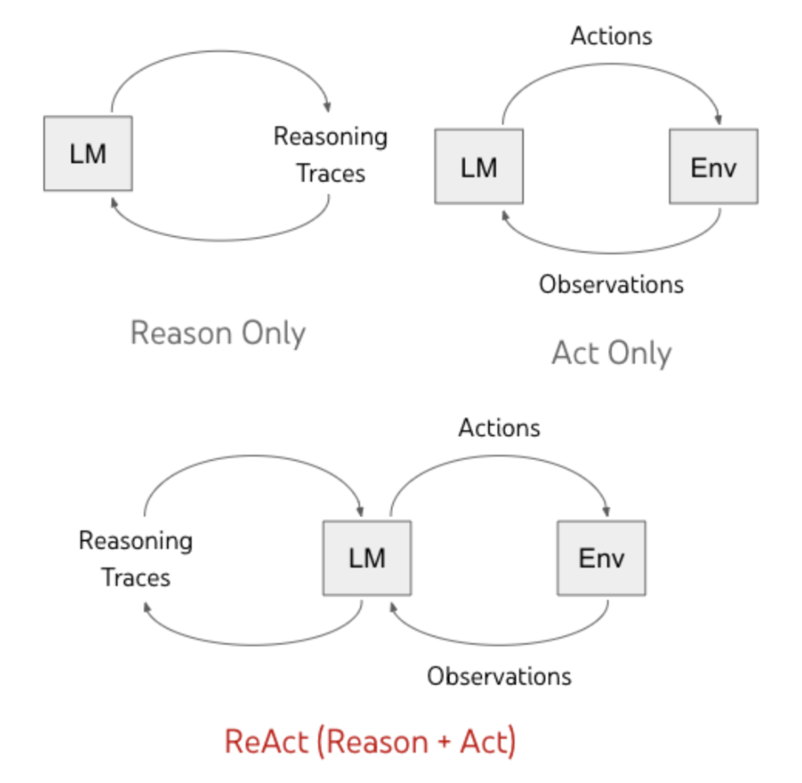

Modern offensive AI is no longer a collection of static scripts. It has evolved into a **reasoning-driven architecture**. To build or understand these systems, one must look past the "hacking" and into the "logic loops." This section explores the granular mechanics of the **Agentic Workflow**, a process that mimics the cognitive functions of a human penetration tester but operates at machine speed.

Historically, automation was linear: a tool ran, provided output, and stopped. The **Offensive Agent**, however, utilizes a **circular logic model** known as the **ReAct (Reasoning and Acting) Framework**. This allows the system to manage uncertainty - the defining characteristic of any real-world security environment.

---

[//]: # ([|TOC|]&#40;&#41;)

[//]: # ([|NEXT|]&#40;&#41;)

